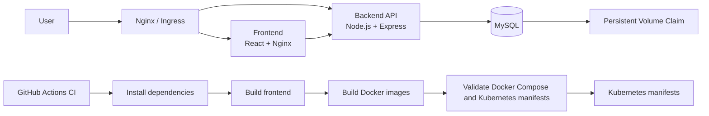

# Resilient Full-Stack Kubernetes Demo

A DevOps-oriented full-stack deployment demo for a small task application.

The project demonstrates how a React frontend, Node.js/Express backend, MySQL database, Nginx reverse proxy, Docker Compose environment, Kubernetes manifests, health checks, and CI workflow fit together in a simplified but realistic portfolio project.

This is not a production system. It is intentionally small so the deployment, orchestration, and debugging workflow stays clear.

## Architecture Overview



Local traffic goes through Nginx on `http://localhost:8080`. Kubernetes traffic goes through the Ingress host `devops-demo.local`.

## Tech Stack

- Frontend: React, Vite, Nginx
- Backend: Node.js, Express, mysql2
- Database: MySQL 8
- Local orchestration: Docker Compose
- Reverse proxy: Nginx
- Kubernetes: Deployments, Services, Ingress, ConfigMap, Secret, PVC
- CI: GitHub Actions

## Project Structure

```text
.
|-- .github/workflows/ci.yml
|-- backend/
|   |-- Dockerfile
|   |-- .env.example
|   `-- src/server.js
|-- docs/
|   |-- DEVOPS_NOTES.md
|   |-- PRODUCTION_IMPROVEMENTS.md
|   `-- RUNBOOK.md
|-- frontend/
|   |-- Dockerfile
|   |-- .env.example
|   `-- src/
|-- k8s/
|   |-- configmap.yml
|   |-- secret.example.yml
|   |-- mysql-pvc.yml
|   |-- mysql-deployment.yml
|   |-- mysql-service.yml
|   |-- backend-deployment.yml
|   |-- backend-service.yml
|   |-- frontend-deployment.yml
|   |-- frontend-service.yml
|   `-- ingress.yml
|-- nginx/nginx.conf
|-- screenshots/
|-- docker-compose.yml
|-- Makefile
`-- README.md
```

## Local Docker Compose Flow

Start the full local stack:

```bash
docker compose up -d --build
```

Open the app:

```text
http://localhost:8080
```

Stop containers while keeping the MySQL volume:

```bash
docker compose down
```

Reset local database data:

```bash
docker compose down -v
```

## Kubernetes Flow

The Kubernetes manifests demonstrate a typical deployment shape:

- Frontend and backend run as Deployments.
- Internal traffic uses Kubernetes Services.
- External HTTP routing uses Ingress.
- Non-sensitive configuration is stored in a ConfigMap.
- Sensitive values are represented by a safe Secret example.
- MySQL stores data through a Persistent Volume Claim.
- Frontend, backend, and MySQL include readiness/liveness probes.
- Containers include basic resource requests and limits.

Before applying to a cluster, create a local secret file:

```bash
cp k8s/secret.example.yml k8s/secret.yml
# edit k8s/secret.yml locally and do not commit real secrets
```

Apply manifests:

```bash
kubectl apply -f k8s/
```

Check status:

```bash
kubectl get pods
kubectl get services
kubectl get ingress
kubectl get pvc
```

The Kubernetes image names are placeholders:

```text
arie/fullstack-backend:v1
arie/fullstack-frontend:v1
```

For a real cluster, build and push images to your registry, then update the image names in the deployment manifests.

## Useful Commands

With Make:

```bash
make compose-up
make compose-down
make compose-build
make compose-logs
make health
make k8s-apply
make k8s-status
make k8s-delete
```

Without Make:

```bash
docker compose up -d --build
docker compose logs -f
curl http://localhost:8080/health
kubectl apply -f k8s/
kubectl get pods,svc,ingress,pvc
```

## Debugging Commands

Docker Compose:

```bash
docker compose ps
docker compose logs -f backend
docker compose logs -f frontend
docker compose logs -f mysql
docker compose logs -f nginx
```

Kubernetes:

```bash
kubectl describe pod POD_NAME
kubectl logs deployment/backend-deployment
kubectl logs deployment/frontend-deployment
kubectl logs deployment/mysql-deployment
kubectl describe ingress fullstack-ingress
```

More troubleshooting examples are in [docs/RUNBOOK.md](docs/RUNBOOK.md).

## Health Check Examples

Backend readiness through the public local proxy:

```bash
curl http://localhost:8080/health
```

Backend API:

```bash
curl http://localhost:8080/api/tasks
```

Kubernetes probes:

- Backend liveness: `/live`
- Backend readiness: `/health`
- Frontend readiness/liveness: `/`
- MySQL readiness/liveness: `mysqladmin ping`

## CI Workflow

The GitHub Actions workflow is intentionally practical and simple:

- Checks out the code.
- Installs backend dependencies.
- Installs frontend dependencies.
- Builds the frontend.
- Validates Docker Compose config.
- Runs a client-side Kubernetes manifest dry run.
- Builds backend and frontend Docker images.

It does not deploy to any environment.

## Screenshots

Screenshots should be added after running the project locally. The repository includes a `screenshots/` folder with a `.gitkeep` placeholder so real screenshots can be added later.

- `screenshots/app-ui.png` - local app running at `http://localhost:8080`
- `screenshots/docker-compose-ps.png` - `docker compose ps` showing healthy services
- `screenshots/health-check.png` - backend health response
- `screenshots/k8s-pods.png` - Kubernetes pods and services
- `screenshots/github-actions-success.png` - GitHub Actions CI run

## What Is Production-Like In This Project

- Clear separation between app code and infrastructure files.
- Containerized frontend and backend services.
- Local orchestration with Docker Compose.
- Nginx reverse proxy in front of app services.
- Kubernetes Deployments, Services, Ingress, ConfigMap, Secret, and PVC.
- Health checks for local and Kubernetes workflows.
- Basic resource requests and limits.
- CI that builds and validates the project.
- Runbook-style troubleshooting documentation.

## What Is Intentionally Simplified

- MySQL runs as a single container/pod.
- Secrets are represented by a safe example file.
- Images use placeholder registry names in Kubernetes.
- There is no automated deployment from CI.
- The app uses a small feature set to keep the focus on deployment.
- Observability is limited to logs and health checks.

## What Would Be Added For Real Production

- TLS and HTTPS-only traffic.
- A real secret manager.
- Container image registry and promotion flow.
- CI/CD deployment with approvals.
- Monitoring, alerting, and centralized logs.
- Backups and restore testing for the database.
- Autoscaling for stateless services.
- Security scanning and stricter runtime policies.
- Environment separation for development, staging, and production.

See [docs/PRODUCTION_IMPROVEMENTS.md](docs/PRODUCTION_IMPROVEMENTS.md) for more detail.

## Why This Project Matters

This project demonstrates practical DevOps thinking for a Junior / Junior+ full-stack developer:

- Understanding of full-stack deployment flow.
- Separation between application code and infrastructure configuration.
- Docker-based local development environment.
- Nginx reverse proxy routing.
- Kubernetes deployment basics.
- Config and secret separation.
- Persistent database storage.
- Health checks and debugging habits.
- Logs and troubleshooting.
- CI awareness without pretending to be a complete production platform.
- Practical DevOps mindset.

## Recruiter-Friendly Summary

This is a compact DevOps-oriented full-stack deployment demo. It shows a React frontend, Node.js backend, MySQL database, Docker Compose local environment, Nginx routing, Kubernetes manifests, health checks, persistent storage, CI, and troubleshooting documentation.

The project is intentionally simplified, but it reflects production-like patterns that are common in real teams.
